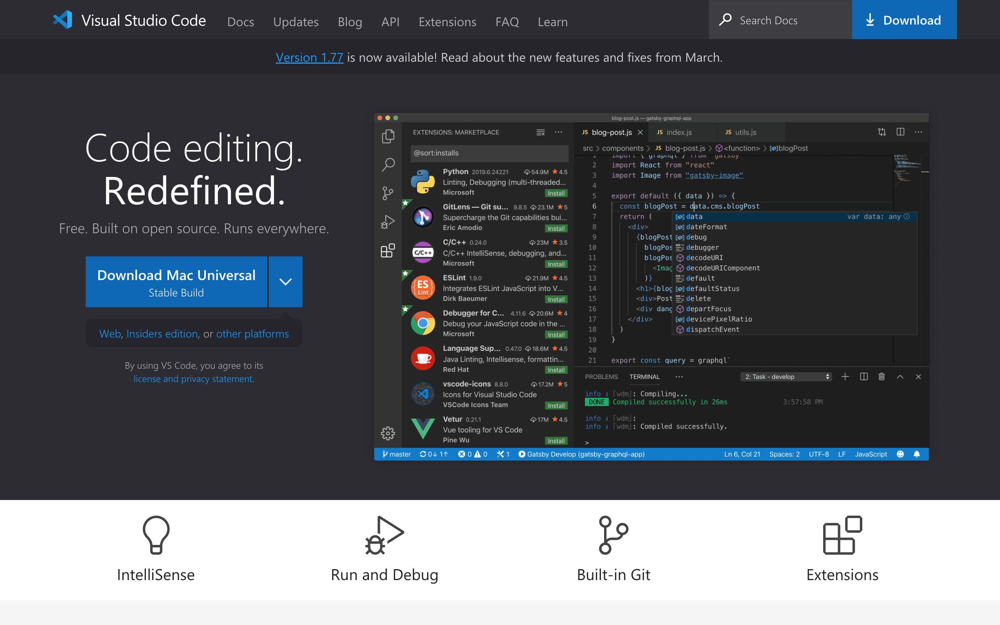
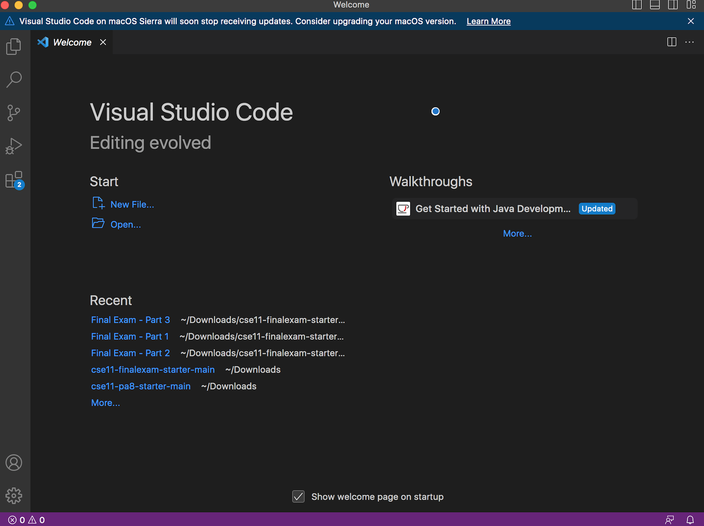
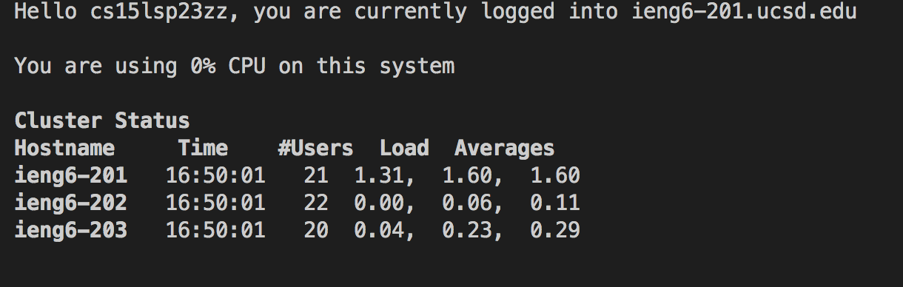
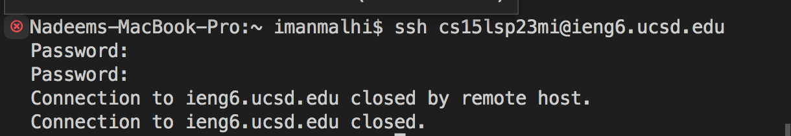
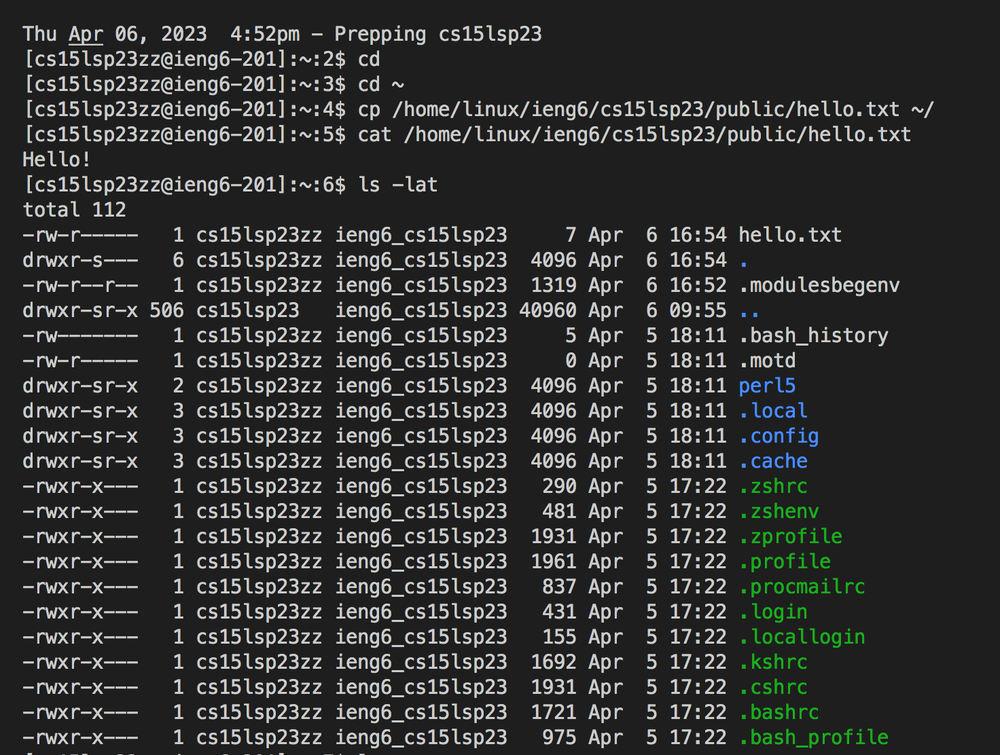

## **LAB REPORT ONE**
**Part I: Installing VScode**

In order to install Visual Studio Code (VScode), visit the website https://code.visualstudio.com/ and make sure to obtain the appropriate download according to your operating system.

You should then be able to open Visual Studio on your computer. Happy coding! :D

**Part II: Remotely Connecting**

Open a new terminal in VScode and enter 'ssh cs15lsp23zz@ieng6.ucsd.edu' into the terminal, but replace the 'zz' portion with your specific cse 15l account (which you can find by visiting https://sdacs.ucsd.edu/~icc/index.php). If asked if you want to keep connecting, enter yes, and make sure to enter your password as well when prompted. 

I was able to login using the cs15lsp23zz@ieng6.ucsd.edu account given by the TA, since my own account (cs15lsp23mi@ieng6.ucsd.edu) gives the following error.

**Part III: Trying Some Commands**

Ater remotely connecting, you should be able to practice using some commands. Try the following commands in the terminal: cd ~, cd, ls -lat, ls -a, cp /home/linux/ieng6/cs15lsp23/public/hello.txt ~/, and cat /home/linux/ieng6/cs15lsp23/public/hello.txt. Also try the commands cd, ls, pwd, mkdir, and cp in different ways to learn what these specific commands do.

