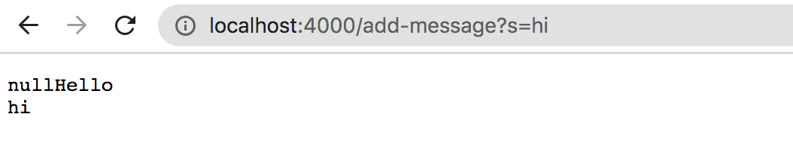
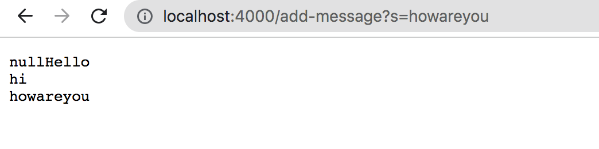

# LAB REPORT 2
## PART I
`
import java.io.IOException;
import java.net.URI;

class Handler implements URLHandler {
   
    int num = 0;
    String s;
    public String handleRequest(URI url) {
        // string server code
        if (url.getPath().contains("/add-message")) {
            // gets index of character '='in string
            int x = url.getQuery().indexOf("=");
            // adds substring beginning from character after "=" 
            s += url.getRawQuery().substring(x+1,url.getRawQuery().length());
            // creates new line
            s += "\n";
            // returns string
            return s;
        } else {
            return "404 Not Found!";
        }

    }
}

class StringServer {
    public static void main(String[] args) throws IOException {
        if(args.length == 0){
            System.out.println("Missing port number! Try any number between 1024 to 49151");
            return;
        }

        int port = Integer.parseInt(args[0]);

        Server.start(port, new Handler());
    }
}
`

In this screenshot, the method `handleRequest` in `StringServer.java` is called to take in the URL as an input. The relevant arguements to these
methods would be the url itself, `URI url`.

Like the earlier screenshot, the method `handleRequest` in S`tringServer.java` is called to take in the URL as an input. The relevant arguements to these
methods would be the url itself, `URI url`.

## PART II
A failure-inducing input for the method `reversed` would be
`
@Test
  public void testReversed() {
    // test 1
    int[] input2 = {2,1,4};
    assertArrayEquals(new int[]{4,1,2}, ArrayExamples.reversed(input2));
  }
  `
### PART III
In the week 3 lab, I learned a lot about debugging and utilizing JUnit tests. Debugging is the process of finding errors in your code, and 
removing said errors by editing the code. JUnit is a java library that is used run tests. In the lab, we used tests such as `assertArrayEquals` to test
our methods. I learn best by practicing, so fixing the code/writing tests for the methods `reverseInPlace` and `reversed` helped me understand
the process of debugging. I also feel more comfortable with writing JUnit tests. Before this lab, I didn't know that JUnit tests are written in
a different class from the methods being tested, and that an `@Test` annotation is required before a void test method.
