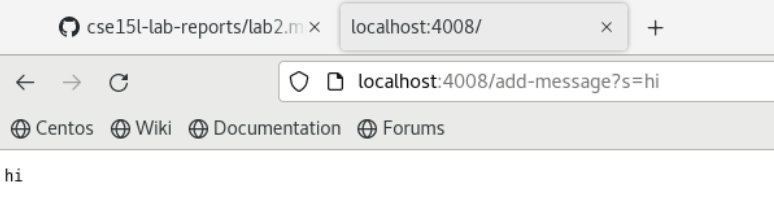
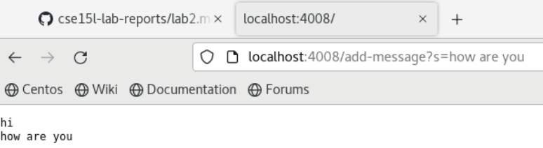

# LAB REPORT 2
## PART I
<pre><code>import java.io.IOException;
import java.net.URI;

class Handler implements URLHandler {
    // The one bit of state on the server: a number that will be manipulated by
    // various requests.
    int num = 0;
    String s = "";
    public String handleRequest(URI url) {
        if (url.getPath().equals("/add-message")) {
            String[] parameters = url.getQuery().split("=");
            s += parameters[1] + "\n";
            return String.format(s, num);
        } else {
            return "404 Not Found!";
        }
    }
}

class StringServer {
    public static void main(String[] args) throws IOException {
        if(args.length == 0){
            System.out.println("Missing port number! Try any number between 1024 to 49151");
            return;
        }
        int port = Integer.parseInt(args[0]);
        Server.start(port, new Handler());
    }
}</code></pre>

In this screenshot, the method `handleRequest` in `StringServer.java` is called to take in the URL as an input. The relevant arguements to these
methods would be the url itself, `URI url`.

Like the earlier screenshot, the method `handleRequest` in `StringServer.java` is called to take in the URL as an input. The relevant arguements to these
methods would be the url itself, `URI url`.

## PART II
Here is the code for the method `reversed` which returns an array with the elements of the input array in reversed order:
<pre><code>static int[] reversed(int[] arr) {
    int[] newArray = new int[arr.length];
    for(int i = 0; i < arr.length; i += 1) {
      arr[i] = newArray[arr.length - i - 1];
    }
    return arr;
  }</code></pre>
  
A failure-inducing input for the method `reversed` would be:
<pre><code>@Test
  public void testReversed() {
    int[] input2 = {2,1,4};
    assertArrayEquals(new int[]{4,1,2}, ArrayExamples.reversed(input2));
  }</code></pre>
  
An input that doesn't induce a failure would be:
<pre><code>@Test
  public void testReversed() {
    int[] input1 = { };
    assertArrayEquals(new int[]{ }, ArrayExamples.reversed(input1));
  }</code></pre>

The symptom, as in the output of the above two tests are:

Before and after the bug in the code is fixed:
Before:
<pre><code>static int[] reversed(int[] arr) {
    int[] newArray = new int[arr.length];
    for(int i = 0; i < arr.length; i += 1) {
      arr[i] = newArray[arr.length - i - 1];
    }
    return arr;
  }</code></pre>
  
After:
### PART III
In the week 3 lab, I learned a lot about debugging and utilizing JUnit tests. Debugging is the process of finding errors in your code, and 
removing said errors by editing the code. JUnit is a java library that is used run tests. In the lab, we used tests such as `assertArrayEquals` to test
our methods. I learn best by practicing, so fixing the code/writing tests for the methods `reverseInPlace` and `reversed` helped me understand
the process of debugging. I also feel more comfortable with writing JUnit tests. Before this lab, I didn't know that JUnit tests are written in
a different class from the methods being tested, and that an `@Test` annotation is required before a void test method.
