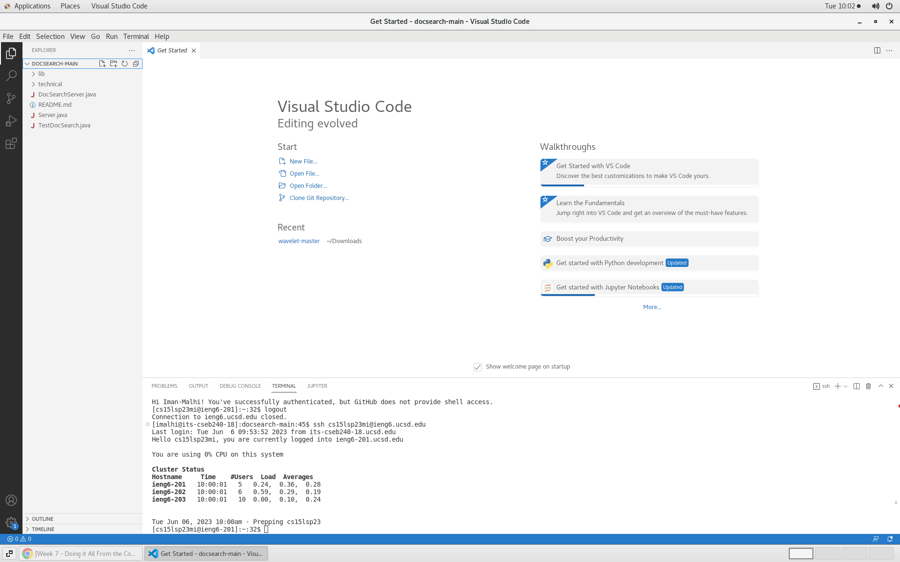
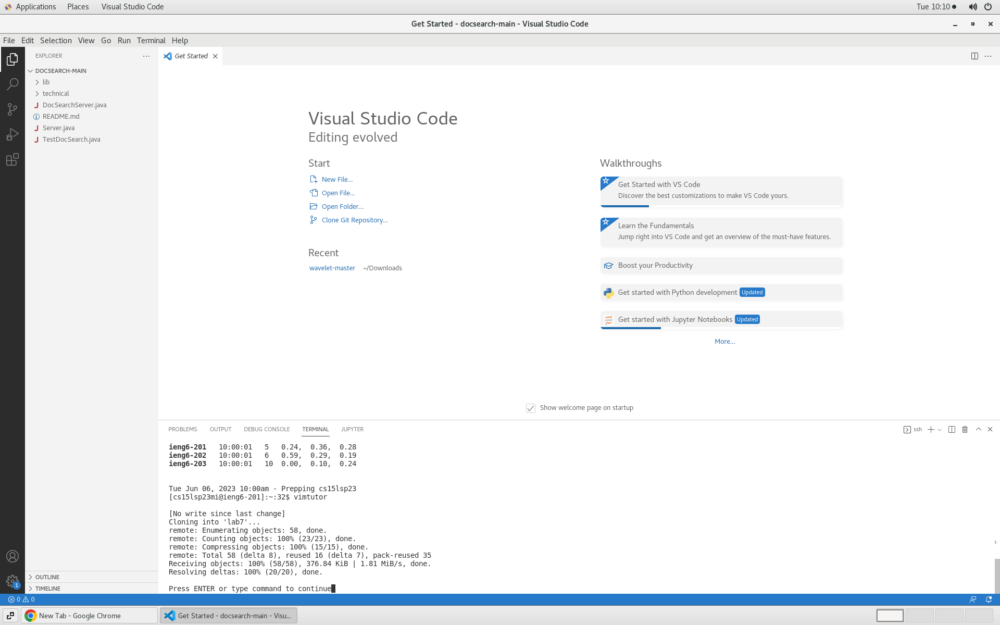
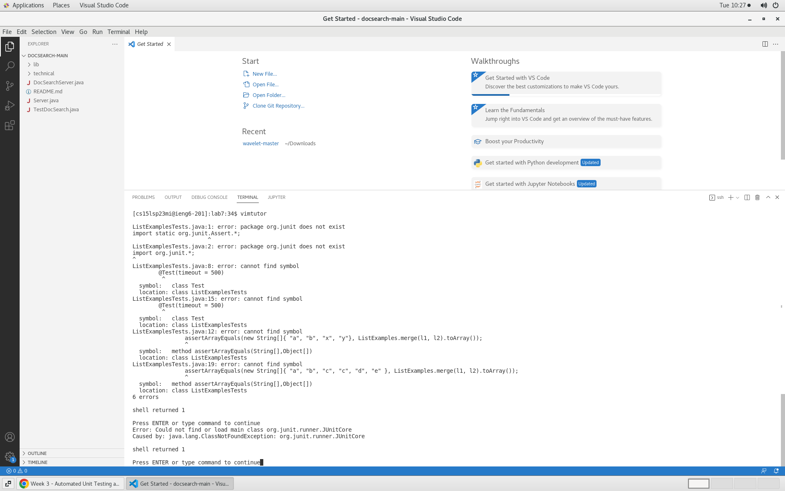
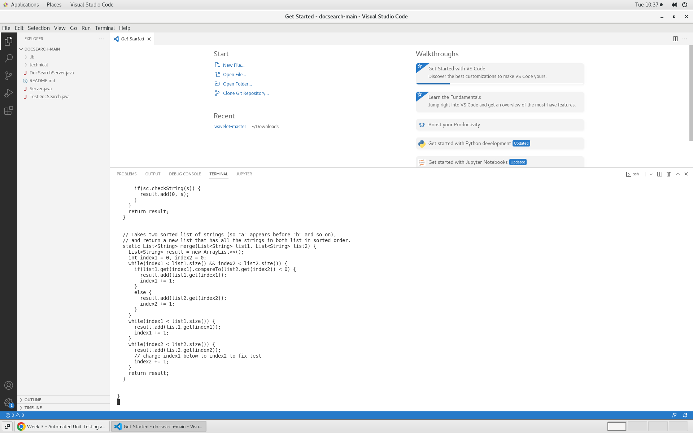
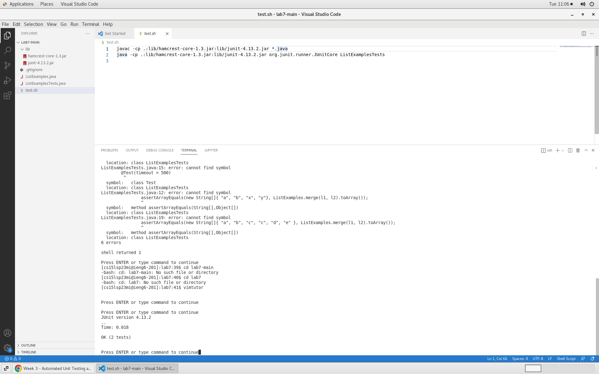
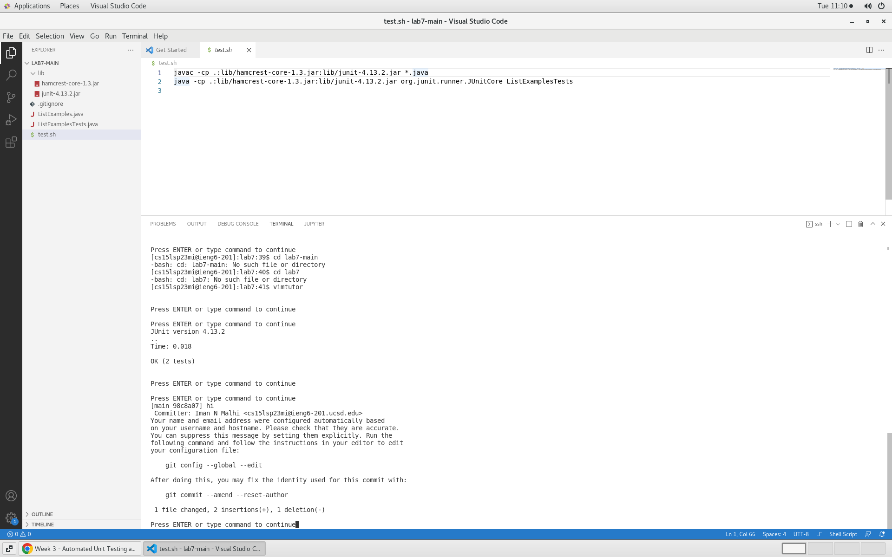

# LAB REPORT 4 #
**Step 4:**

Logged into ieng6 by typing `ssh cs15lsp23mi@ieng6.ucsd.edu` (not in vim yet).

**Step 5:**

Entered vim mode by entering the command `vim tutor`. Entered `:!git clone https://github.com/Iman-Malhi/lab7.git <enter>` to clone repository.

**Step 6:**

`:!javac -cp .:lib/hamcrest-core-1.3.jar:lib/junit-4.13.2.jar ListExamples.java ListExamplesTests.java <enter> :!java -cp .:lib/hamcrest-core-1.3.jar:lib/junit-4.13.2.jar org.junit.runner.JUnitCore ListExamplesTests <enter>` These commands compline and run the files.

  
**Step 7:**

`:e ListExamplesTests.java <i> <delete> 2 <escape> :w` The `:e` open the ListExamplesTests.java file. `<i>` switches to insert mode. `<delete> 2` refers to entering 2 to replace 1 in code shown below and `:w` command saves.

**Step 8:**

`:!javac -cp .:lib/hamcrest-core-1.3.jar:lib/junit-4.13.2.jar ListExamples.java ListExamplesTests.java <enter> :!java -cp .:lib/hamcrest-core-1.3.jar:lib/junit-4.13.2.jar org.junit.runner.JUnitCore ListExamplesTests <enter>` These commands compline and run the files.

  
**Step 9:**
  
`:!git add --all` 
`:!git commit -m "hi"`
`:!git push origin`
`:!git add --all` moves all changes so they can be committed and pushed. `:!git commit -m "hi"` pushes the altered code, "hi" is the commit message. `:!git push origin` pushes to github.

