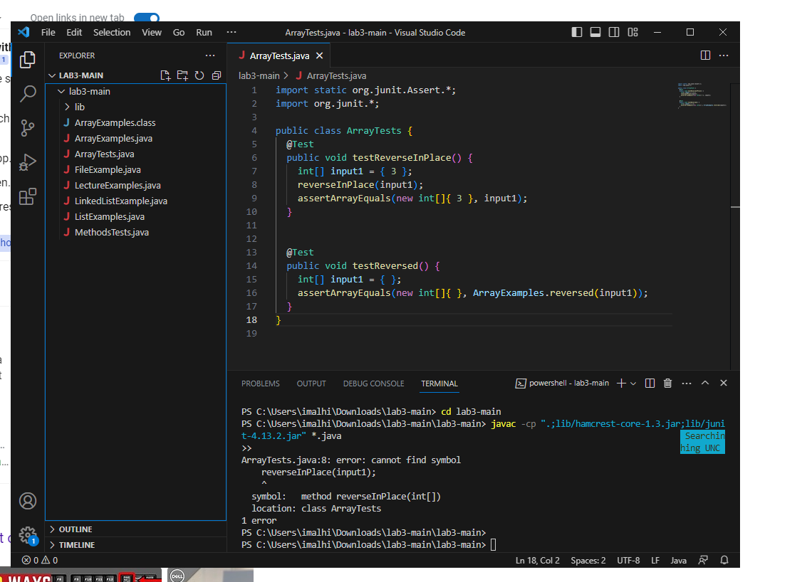
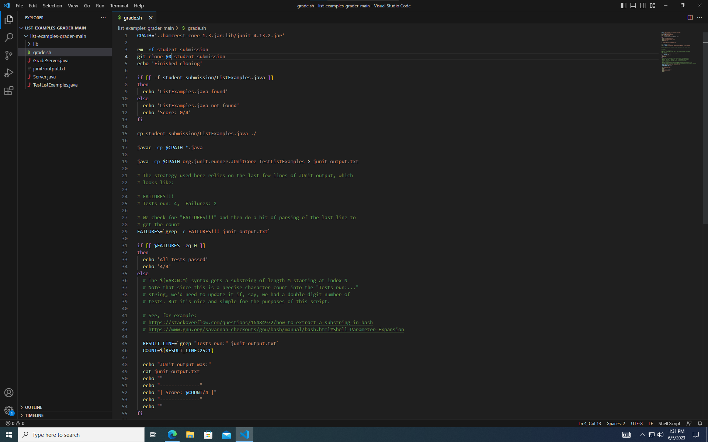
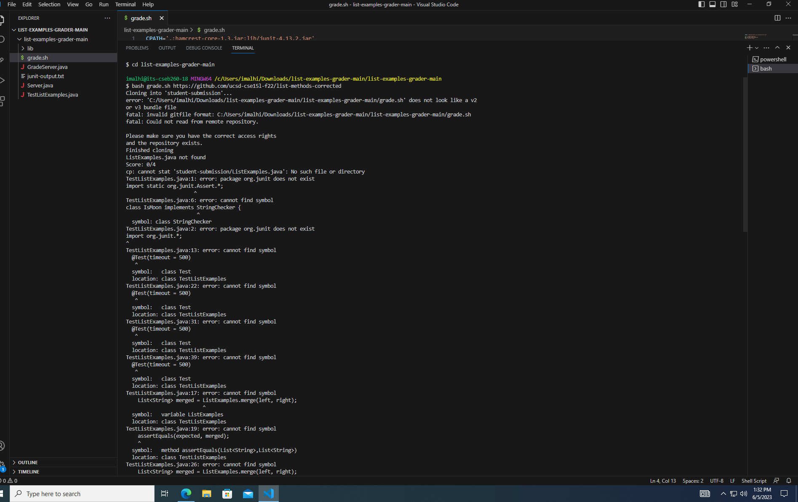
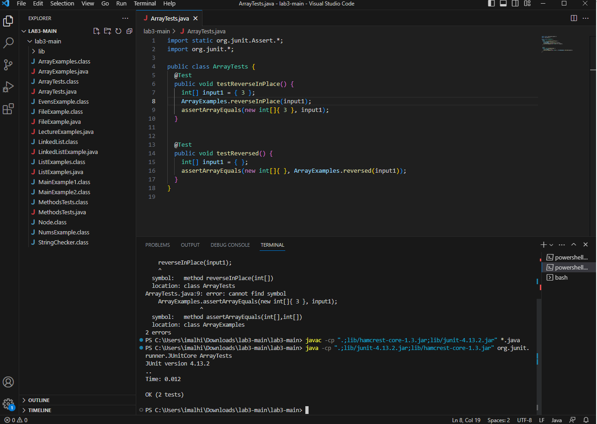
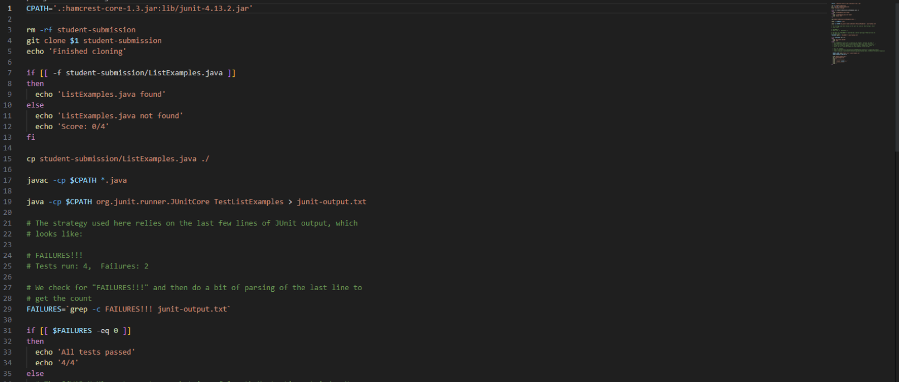

## LAB REPORT 5 ##
### Part I: Debugging Scenario ###
### 1. Original Post from student: ###
**What environment are you using (computer, operating system, web browser, terminal/editor, and so on)?**
Windows
**Detail the symptom you're seeing. Be specific; include both what you're seeing and what you expected to see instead. Screenshots are great, copy-pasted 
terminal output is also great. Avoid saying “it doesn't work”.**
First bug is from the [lab 3 code repository](https://github.com/ucsd-cse15l-w23/lab3). The bug is an `error: cannot find symbol` for the JUnit test testing the 
method `reverseInPlace`. The expected answer would be for the two JUnit tests to pass.
Second bug is from the [week 6 lab](https://github.com/ucsd-cse15l-s23/list-examples-grader). In this case the bug is also an `error: cannot find symbol`. The 
grade.sh bash script will not run when testing student submission code. The expected output would be the grade.sh script checking student submission code
(the github link in the terminal). 
**Detail the failure-inducing input and context. That might mean any or all of the command you're running, a test case, command-line arguments, working 
directory, even the last few commands you ran. Do your best to provide as much context as you can.**
The error and code for bug #1 is shown in the screenshot below.

The error and the code for bug #2 is shown in the screenshots below.

### 2. TA Response: ###
Hello! Both errors are similar in nature. Since both errors are error: cannot find symbol, both errors are a result of a mistype or a missing symbol/piece of 
code. For the first bug, calling `reverseInPlace(input1);` is not enough. You have to call the class the method is from. Thus, the correct line of code would be
`ArrayExamples.reverseInPlace(input1)`;. The JUnit Tests should pass when you fix this.
For the second bug, the error lies in the `git clone $0 student-submission line`. It should be `git clone $1 student-submission`. This is because the 
$0 referse to the name of the script and the $1 refers to the first argument in the terminal. We want the git clone to look at the githubstudent submission link, 
so $1 is needed, not $0.
### 3. Student Correction: ###
I was able to correct both errors. To summarize a description for the bugs would be that bug #1 required a reference to the class in which the
reverseInPlace method was in, in order to run the JUnit tests and for bug #2 the grade.sh script should git clone $1 instead of $0 to look at the first 
arguement in the terminal.
The corrections are in the screenshots below.

### Part II: Reflection ###
One of the most interesting things I learned this quarter was vim. Prior to this class I had never heard of vim. I also found the different modes
of vim interesting. Vim starts in normal mode. Normal mode does not allow you to enter text. In order to enter text you must enter Insert mode (you must
click on `i` to enter insert mode). Vim is a text editor and is much more sophesitcated then something like Notepad. There are many more
commands/modes in vim that I hope to learn in the future.
